# matplotlib
* 一直都需要matplotlib绘图，但是却是用啥学啥，很多还是不会，所以来系统的学下吧!加油

## 1.基本绘图结果


## 2.多图结果
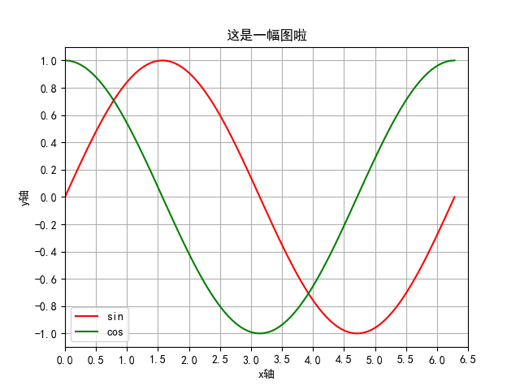

## 3.同一个x不同的y
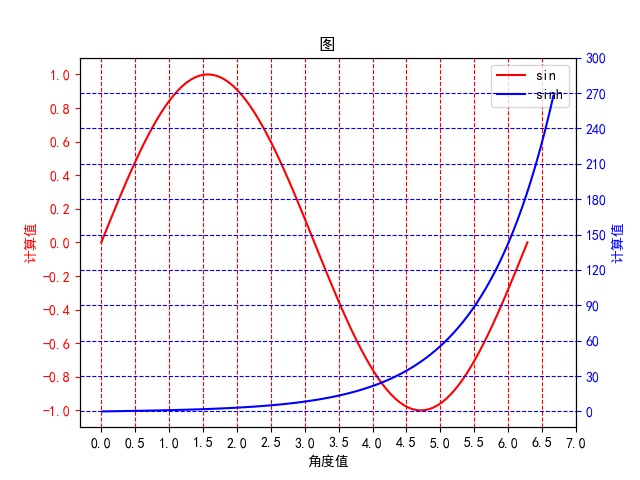

## 4.同一个y不同的x
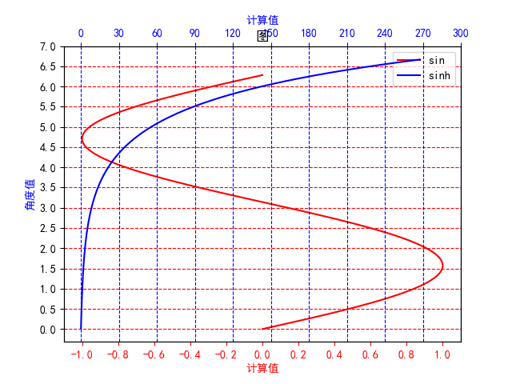

## 5.移动坐标轴
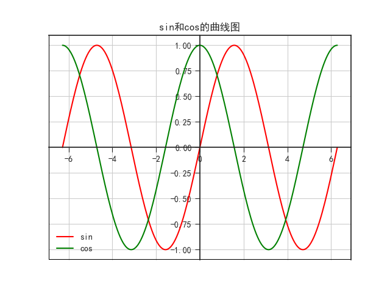

## 6.颜色
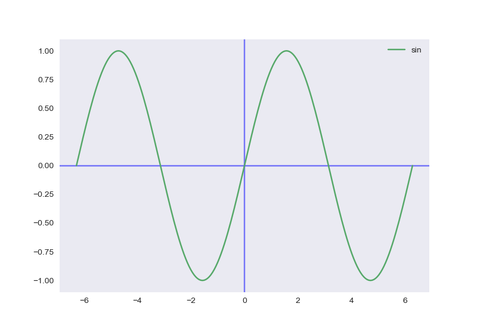

## 7.直方图
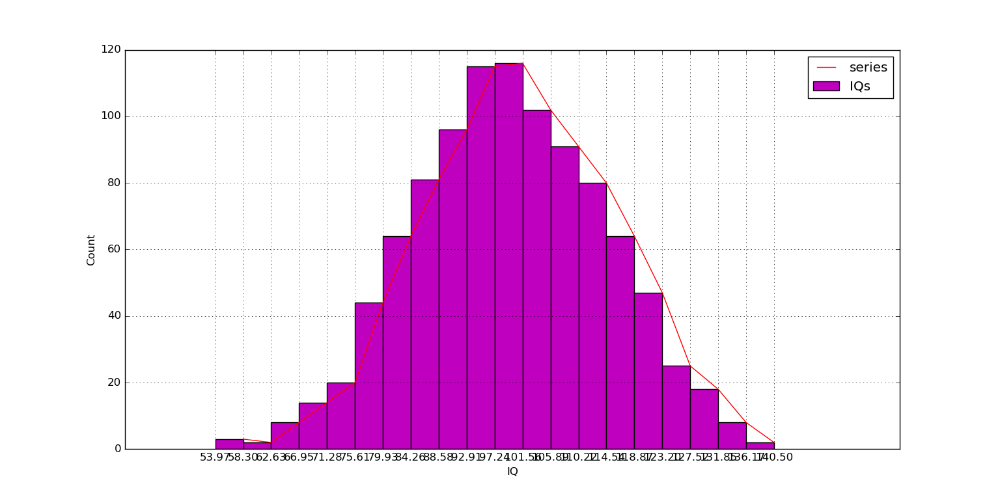

## 8.柱状图
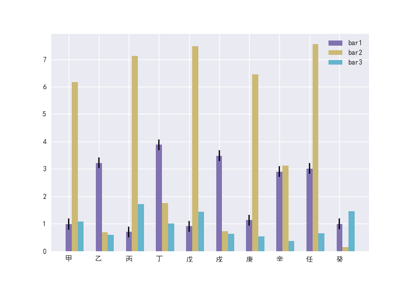

## 9.堆叠柱状图
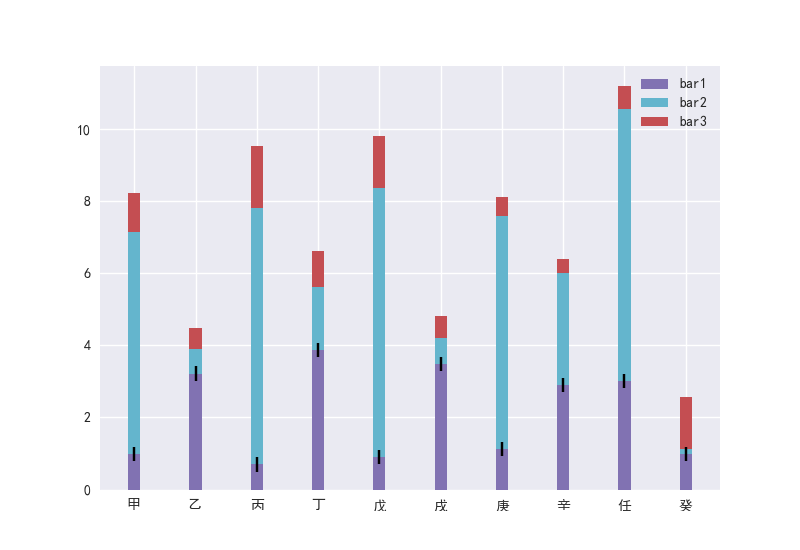

## 10.水平条形图
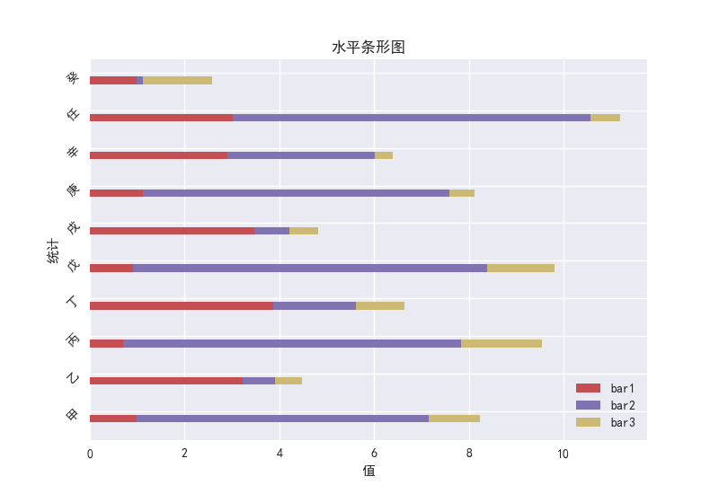

## 11.散点图
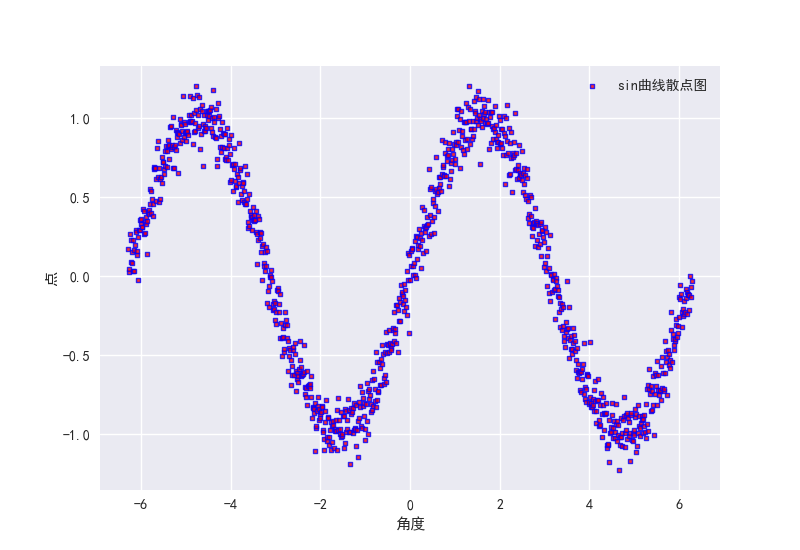

## 12.饼状图
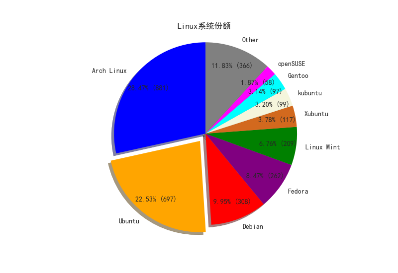

## 13.图像注释
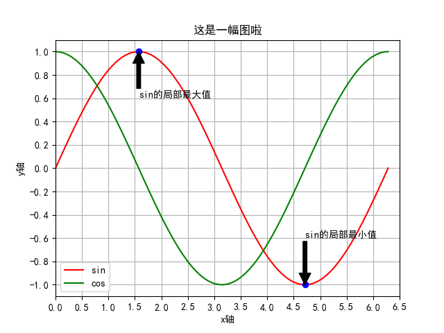

## 14.填充颜色
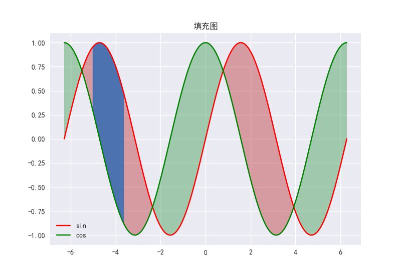

## 15.子图和多图
* 一个子图
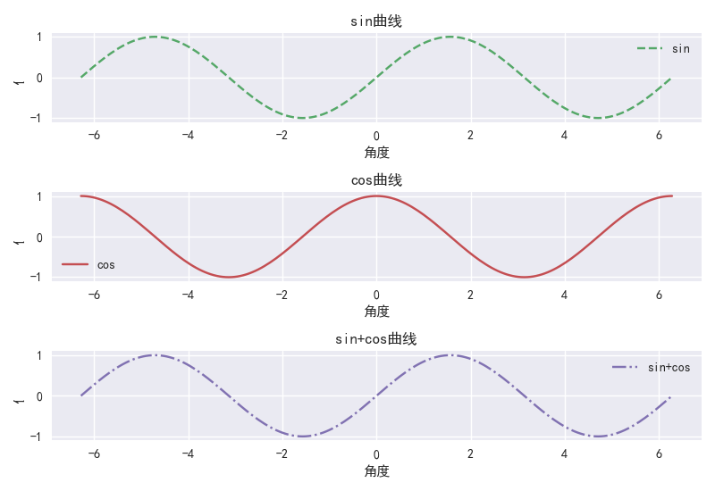

* 子图中值显示不完全，可以采用
```python
mpl.style.use('classic')
```
来解决

* 三个多图
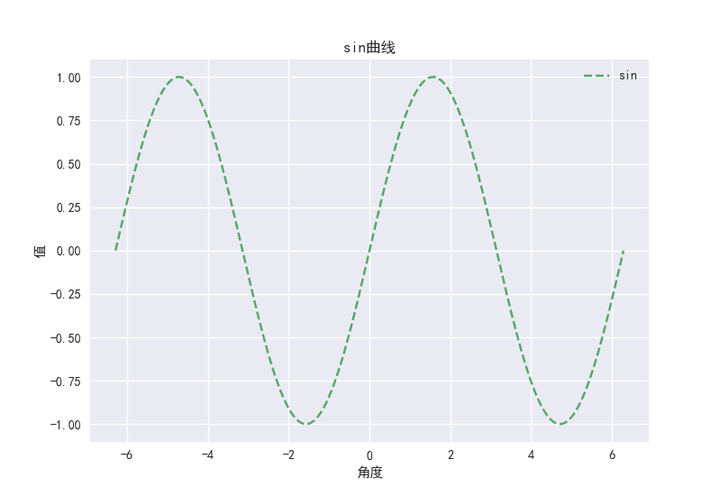
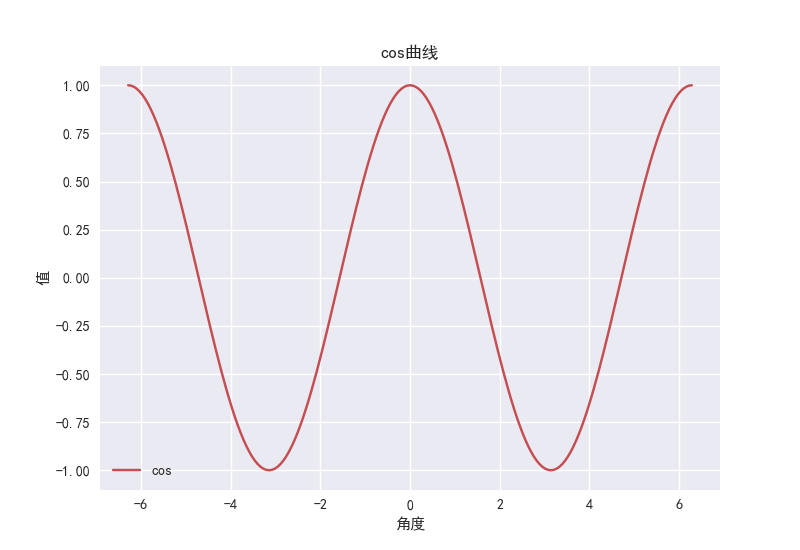
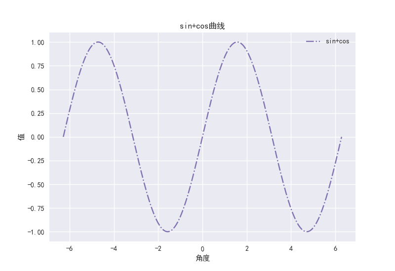

## 16.基于对象多子图
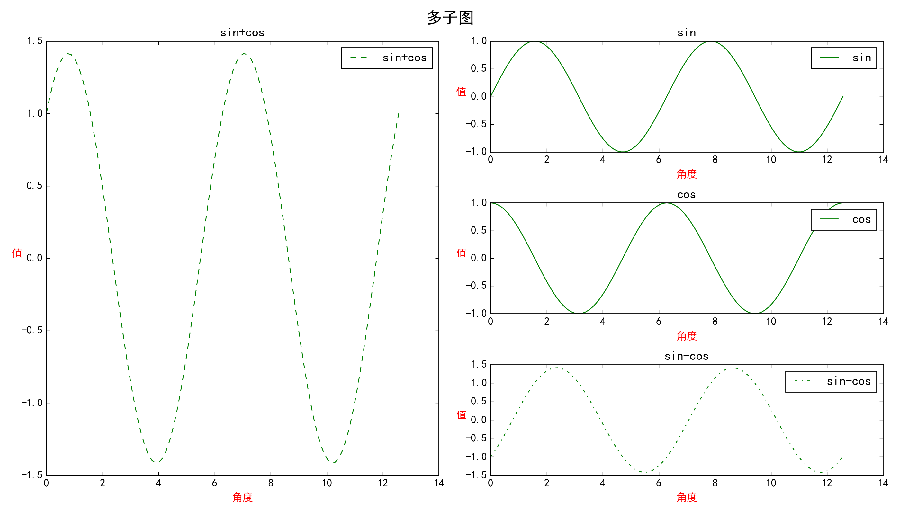

## 17.子图网格
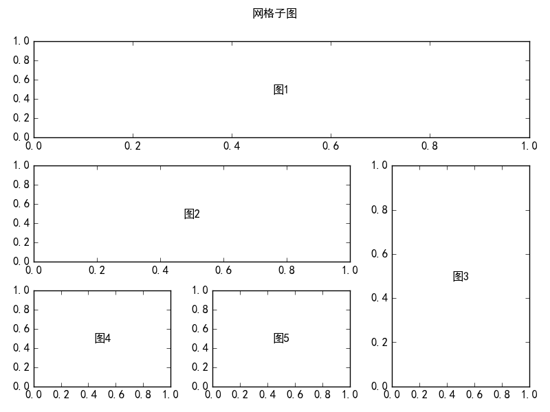

## 17.图像
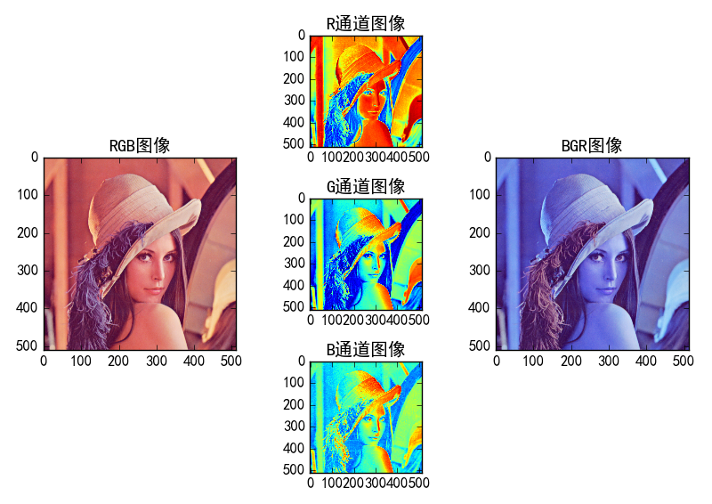
